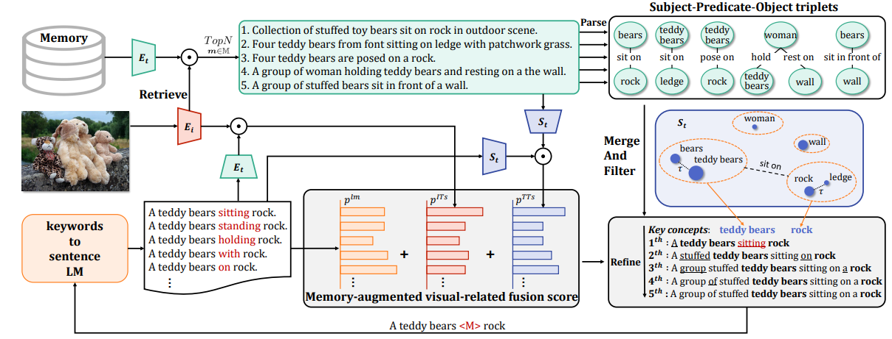

# 
`A collection of down stream tasks using FACTUAL`

**A collection of down stream tasks using [FACTUAL](https://arxiv.org/pdf/2305.17497)**

## All papers cite FACTUAL

### 2025

[**Arxiv2025**-CutPaste&Find: Efficient Multimodal Hallucination Detector with Visual-aid Knowledge Base](https://arxiv.org/abs/2502.12591) 

**Task: Multimodal Hallucination Detection**

**FACTUAL usage:**

- Textual Parsing

- Attribution Extraction

- Relation Extraction

**Code Availability: ❌**

**Data Availability: ✅**

[**Arxiv2025**-LaVCa: LLM-assisted Visual Cortex Captioning](https://arxiv.org/abs/2502.13606)

**Task: Keywords extrator of Refiner for image captions generated by VLLM**

**FACTUAL usage:**

- Keywords Extractor (LLM)

- Entities Extraction

- Relation Extraction

**Code Availability: ❌(Project page dead)**

**Data Availability: ✅**

[**Arxiv2025**-Fine-Grained Video Captioning through Scene Graph Consolidation](https://arxiv.org/abs/2502.16427)

**Task: Fine-Grained Video Captioning**

**FACTUAL usage:**

- Video frame caption parsing (Little short)

**Code Availability: ❌**

**Data Availability: ✅**

[**ICASSP2025**-Semantic Graph Embedded Energy Minimization Learning for Scene Graph Generation](https://ieeexplore.ieee.org/abstract/document/10889599/?casa_token=n7tc2sVboPQAAAAA:l-NQTQAzN0gc3Av9_bbCacoI9Q8DRu0iq8s__5bg2Gqf6UFhq62hohqDeiZ7L49HEjOFWJldZ3-_)

**Task: Scene Graph Generation**

**FACTUAL usage:**

- Serve as Semantic parser, whose results will be used for SGG

**Code Availability: ❌**

**Data Availability: ⚠️(Available but too short, VG dataset etc.)**

[**CVPR2025**-Benchmarking Large Vision-Language Models via Directed Scene Graph for Comprehensive Image Captioning](https://arxiv.org/abs/2412.08614)

**Task: Benchmarking Large Vision-Language Models**

**FACTUAL usage: Just Cited**

- 

      {
        "category": "jar",
        "short_description": "a jar with white condiments.",
        "mask_out": "eJzt0sFRA0EQwEBnR/4Z8YcCfDtzFgXdEeihxwMAAAAAAAAAAAAAAAAAAAAAAAAAAAAAAAAAAAAAAAAAAAAAAAAAAAAAAAAAAAD+iLeP6iD+j0/zeZCX+eo+B/IC3+1nQO71/X0O5FY/72dAbvPMfg7kJk/uZ0Du8PR+BmTfhf0MyLpL/xmQXdf2MyCrru7nPzZd/s+A7Lm+nwFZc7Kf/1hytJ8BWXL4nwHZcLqf/1hwvJ//WHD+nwEZG+znP6Ym+/mPodF+BmRmuJ//mJju5z8m/EdovJ//GPAfofl+/uPYwn7+45j/KPmP0MZ+/uOU/yj5j9DKfv7jkP0o+Y+S/yjZj8rGe/7jlP3oLN3nP47Yj5D9KNmPkP0I2Y+S/QjZj5D9CNmPkP0o2Y+Q/Sj5j5L9CNmPkv0I2Y+S/SjZj5L9KNmPkv0o2Y+S+yjZj5L/KNmPlP0o+Y+S/UjZj5L/KNmPlPso2Y+U/Sj5j5T9SNmPlP1I2Y+U/0jZj5b7aNmPlv1ouY+Y9wAAAAAAAAAAAAAAAAAAAAAAAAAAAAAAAAAAAAAAAAAAAAAAAAAAAAAAAAAAAAAAAAAAAAAAAAAAAAAAAAAAAAAAAAAAAAAAAAAAAAAAAAAAAAAAAAAAAAAAAAAAAAAAAAAAAAAAAAAAAAAAAAAAAAAAAAAAAAAAAAAAAAAAAAAAAAAAAAAAAAAAAAAAAAAAAAAAAAAAAAAAAAAAAAAAAAAAAAAAAAAAAAAAAAAAAAAAAAAAAAAAAAAAAAAAAAAAAAAAAAAAAAAAgN/sHZ5riqI=",
        "extend_description": "A cylindrical glass jar with a slightly domed metal lid is filled with white condiments, with the glass material transparent.",
        "relation": [
          "The jar is on the countertop."
        ]
      },
      {
        "category": "appliance",
        "short_description": "a silvery and black electronic appliance.",
        "mask_out": "eJzt0gluFEEQRUEfr+9/IgQIxIxn6aWqnpEjLpD5pffxAQAAAAAAAAAAAAAAAAAAAAAAAAAAAAAAAAAAAAAAAAAAAAAAAAAAAAAAx21b/QHf2SZAQpsACW2bAulsf9SP8C1tmwLpbDfqb/huNgES2u7VD/GtfOpPgSz0oD8Bssyj/hTIKo/7UyBrPOtPgazwvD8BMt+L/gTIdK/6EyCzvexPgEz2uj8BMteb/hTIVG/7EyATve9PgMyzoz8BMs2e/gTILLv6UyCT7OxPgEyxtz8BMoP+KO3uT4FMcKA/ATLckf4EyGiH+hMggx3rT4CMdbA/ATLU0f4EyEiH+xMgAx3vT4CMc6I/ATLMmf4UyCjn+hMgY5zsT4AMcbY/ATLC6f4EyADn+xMg113oT4BcdqU/BXLVtf4EyDUX+xMgl1ztT4Bccbk/AXLB9f4EyHkD+hMgp43oT4CcNaQ/BXLSoP4EyCmj+hMgZwzrT4CcMK4/AXLcwP4EyGEj+xMgRw3tT4AcNLY/AXLM4P4EyCGj+xMgRwzvT4AcML4/AbLfhP4EyG4z+hMge03pT4DsNKc/AbLPpP4EyC6z+hMge0zrT4DsMK8/BfLezP4EyDtT+xMgb8ztT4C8Nrk/AfLS7P4EyCvT+xMgL8zvT4A8t6A/AfLUiv4EyDNL+hMgT6zpT4A8tqg/AfLQqv4EyCPL+hMgD6zrT4B8trA/AfLJyv4EyL2l/QmQO2v7EyC3FvcnQG6s7k+A/Gt5fwrkH/qjFPQnQP4q+lMgfzT9CZDfov4EyC/6o1T1J0B+0h8l/VHK+hMgH/qjpT9K+qOkP0r6o6Q/Sl1/AkR/tPRHSX+U9Ecp7E+A6I+U/ijpj5L+KOmPkv4o6Y+S/ijpj5L+KOmPkv4o6Y+S/ijpj5L+KOmPkv4oyY+S/iitDU5+3NIfJf1R0h+lpf3d1Qgr+7tVL+cr0B8l/VGSHyX9UZIfJf1R0h+lZbnpjwcW9Xevns0XoT9K+qOkP0r6oyQ/SvKjpD9Ka7PTH7eW9ic/7qzsT37c0x8l+VHSHyX9UZIfpQXByY+n9Edpfn/y47ll3emPB9b2V6/lq1mV389L9Va+nnX9wWf6oyQ/SvKjpD5K8qM0LTv9sYP+KM3qT37soT9K8qMkP0r6oyQ/SvKjJD9K8qOkP0ryoyQ/SvqjJD9K+qMkP0ryo6Q+SvKjpD9K8qMkP0ryoyQ/SvqjJD9K8qMkP0rqoyQ/SvqjJD9K8qMkP0ryoyQ/SvKjpD5K8qMkP0ryoyQ/SvKjJD9K8qMkP0rqo6Q+SuqjpD5K8qMkP0ryoyQ/SvKjJD5K6qOkPkrqoyQ/SuqjJD5K8qMkP0ryoyQ+StqjpD5K4qOkPEryo6Q+SuIDAAAAAAAAAAAAAAAAAAAAAAAAAAAAAAAAAAAAAAAAAAAAAAAAAAAAAAAAAAAAAAAAAAAAAAAAAAAAAAAAAAAAAAAAAAAAAAAAAAAAAAAAAAAAAAAAAAAAAAAAAAAAAAAAAAAAAAAAAP53PwAcmqOb",
        "extend_description": "The silver and black electronic appliance features a silver-colored metallic section with a smooth and reflective surface and a black control panel with various buttons, each labeled with white text.",
        "relation": [
          "The appliance is on the countertop.",
          "The appliance is next to the dish."
        ]
      }

**Code Availability: ✅**

**Data Availability: ✅ (medium length)**

### 2024

[**EMNLP2024**-Tag-grounded Visual Instruction Tuning with Retrieval Augmentation](https://aclanthology.org/2024.emnlp-main.120/)

**Task: Visual Instruction Tuning** 

**FACTUAL usage:**

- generate caption tags
- encode the tags into instruction like how llava encode and merge the visual prompt

**Code Availability: ❌**

**Data Availability: ✅**

[**CVPR2024**-Hallucidoctor: Mitigating hallucinatory toxicity in visual instruction data](http://openaccess.thecvf.com/content/CVPR2024/html/Yu_HalluciDoctor_Mitigating_Hallucinatory_Toxicity_in_Visual_Instruction_Data_CVPR_2024_paper.html)

**Task: Mitigating Hallucinatory**

**FACTUAL usage:**

- Aswer Chunks Extraction

**Code Availability: ✅**

**Data Availability: ✅**

[**CVPR2024**-Meacap: Memory-augmented zero-shot image captioning](http://openaccess.thecvf.com/content/CVPR2024/html/Zeng_MeaCap_Memory-Augmented_Zero-shot_Image_Captioning_CVPR_2024_paper.html)

**Task: Zero-shot Image Captioning**

**FACTUAL usage:**

- convert topk relevant description into triples.
- merge nodes to get key concepts

**Code Availability: ✅**

**Data Availability: ⚠️(Available but too short, MSCOCO dataset etc.)**

~~[**CVPR2024**-Generative region-language pretraining for open-ended object detection](http://openaccess.thecvf.com/content/CVPR2024/html/Lin_Generative_Region-Language_Pretraining_for_Open-Ended_Object_Detection_CVPR_2024_paper.html)~~

~~**Task: **~~

~~**FACTUAL usage:**~~

~~**Code Availability: ❌**~~

~~**Data Availability: **~~

[**ACM'MM2024**-HICEScore: A Hierarchical Metric for Image Captioning Evaluation](https://dl.acm.org/doi/abs/10.1145/3664647.3681358)

**Task: Metric for Image Captioning Evaluation**

**FACTUAL usage:**

- parse candidates and human reference caption into triples
- cal score between encoded triples and encoded image segments from SAM

**Code Availability: ❌ Coming soon...**

**Data Availability: ⚠️(Available but too short, MSCOCO dataset etc.)**

[**ICML2024**-Evaluating and analyzing relationship hallucinations in large vision-language models](https://arxiv.org/abs/2406.16449)

**Task: Relationship Hallucination (relation-relation, subject-relation, relation-object)**

**FACTUAL usage:**

-  extract relationship triplets from COCO captions.( Subsequently, leveraging the LLM, we generate ‘Yes’ or ‘No’ questions based on both nocaps captions and the pre-extracted set of relationships.)

**Code Availability: ✅**

**Data Availability: ⚠️(Available but too short, nocaps dataset.)**

[**Arxiv2024**-Benchmarking and improving detail image caption](https://arxiv.org/abs/2405.19092)

**Task: Detail Image Caption Benchmarking**

**FACTUAL usage:**

- Core information extraction

- extract objects, attributes and relations from a given caption for following matching modules

- We match the extracted elements from candidate and ground truth captions through a stop words filtering module and a three-stage matching strategy.

**Code Availability: ✅**

**Data Availability: ✅ (Adopted)**

[**Arxiv2024**-A Survey of Hallucination in Large Visual Language Models](https://arxiv.org/abs/2410.15359)

**Task: Survey**

**FACTUAL usage:**

- Introduce FACTUAL in HalluciDoctor

**Code Availability: ❌**

**Data Availability: ❌**

[**EMNLP2024**-Tag-grounded Visual Instruction Tuning with Retrieval Augmentation](https://aclanthology.org/2024.emnlp-main.120.pdf)

**Task: Enhancing MLM in identify novel objects or entities, mention of non-existent objects, find object’s attributed details**

**FACTUAL usage:**

- parse each caption into a set of tags
- use tags as an additional representation to enhance model performance

**Code Availability: ❌**

**Data Availability: ✅ LLaVA-665K and ShareGPT4V-665K**

[**IJCNN2024**-Exploiting Visual Relation and Multi-Grained Knowledge for Multimodal Relation Extraction](https://ieeexplore.ieee.org/abstract/document/10650770/?casa_token=FJRI0PJeWbsAAAAA:3ohJpVxbhc91_5Mh5hHpuy-heFHNoBMtGfb-aIlEevUMFdZ3ncEpQjeIxSBD6Lo4bFQS9B4tIfOi)

**Task: Multimodal Relation Extraction**

**FACTUAL usage:**

- obtain text scene graphs
- Textual tokens and visual objects in two scene graphs are encoded by CLIP
- Similarity scores between two scene graphs are computed to obtain initial node and relation representations for the unified multimodal graph.

**Code Availability: ❌**

**Data Availability: ⚠️(Available but too short) MNRE**

[**ResearchSquare2024**-Multimodal scene-graph matching for cheapfakes detection](https://www.researchsquare.com/article/rs-4553024/latest)

**Task: cheapfakes detection**

**FACTUAL usage:**

- extract textual scene graphs from the captions
- embed and fuse the parsed scene graphs for classification

**Code Availability: ❌**

**Data Availability: ⚠️(Available but too short) IEEE ICME 2023 Grand Challenge on Detecting Cheapfakes.**

### 2023

[**Arxiv2023**-Linear Alignment of Vision-language Models for Image Captioning](https://arxiv.org/abs/2307.05591)

**Task: Alignment of Vision-language Models for Image Captioning**

**FACTUAL usage:**

- ❌ Not using FACTUAL but SoftSPICE

**Code Availability: ❌**

**Data Availability: ⚠️(Available but too short) MS-COCO and Flickr30k**

